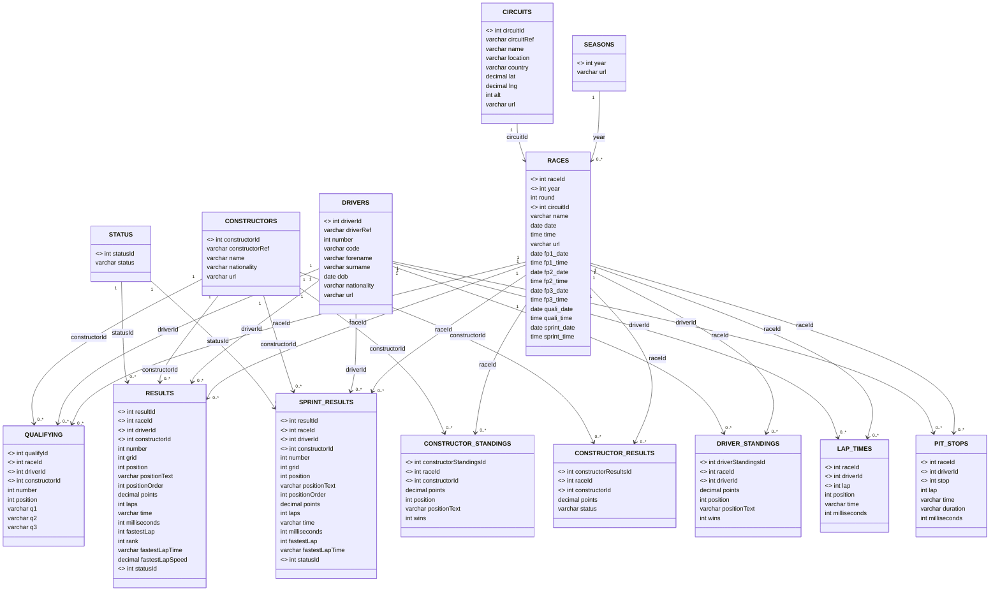

# Formula 1 Database - Entity Relationship Diagram

## ER Diagram (Phase II Part D)

## Key Relationships:

1. **SEASONS** → **RACES**: One season has many races
2. **CIRCUITS** → **RACES**: One circuit hosts many races
3. **RACES** → **RESULTS**: One race has many results
4. **DRIVERS** → **RESULTS**: One driver has many results
5. **CONSTRUCTORS** → **RESULTS**: One constructor has many results
6. **STATUS** → **RESULTS**: One status applies to many results

## Entity Descriptions:

- **SEASONS**: Formula 1 seasons (1950-present)
- **CIRCUITS**: Racing circuits around the world
- **CONSTRUCTORS**: F1 teams/constructors
- **DRIVERS**: F1 drivers
- **STATUS**: Race finish status (Finished, DNF, etc.)
- **RACES**: Individual Grand Prix races
- **RESULTS**: Race results and points
- **QUALIFYING**: Qualifying session results
- **SPRINT_RESULTS**: Sprint race results
- **CONSTRUCTOR_STANDINGS**: Constructor championship standings
- **CONSTRUCTOR_RESULTS**: Constructor race results
- **DRIVER_STANDINGS**: Driver championship standings
- **LAP_TIMES**: Individual lap times
- **PIT_STOPS**: Pit stop data

This ER diagram shows the complete structure of your Formula 1 database with all entities, attributes, and relationships.
